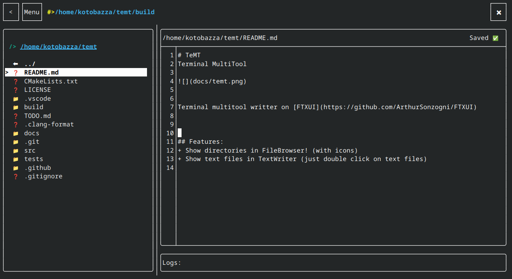

# TeMT
Terminal MultiTool

Terminal multitool writter on [FTXUI](https://github.com/ArthurSonzogni/FTXUI)

## Features:
+ Show directories in FileBrowser! (with icons)
+ Show text files in TextWriter (just double click on text files)

## Custom-viewer
TeMT forks old repo [custom-viewer](https://github.com/kotobazza/custom-viewer)